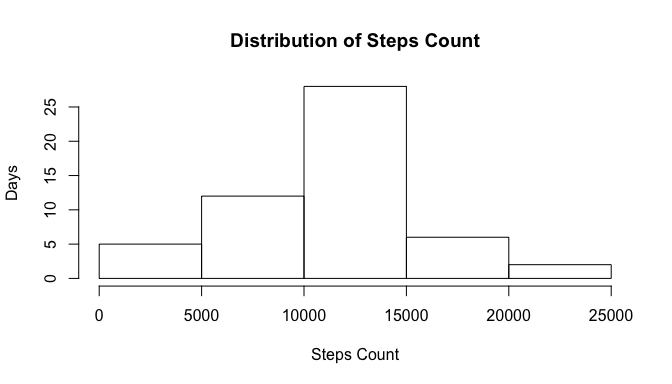
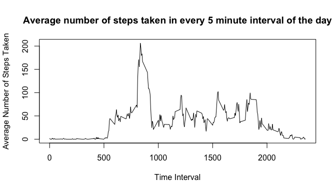
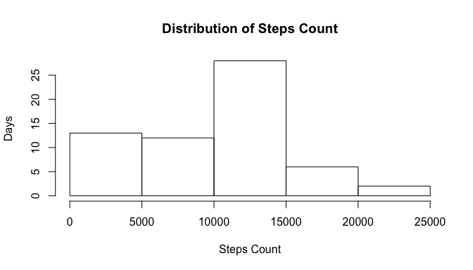
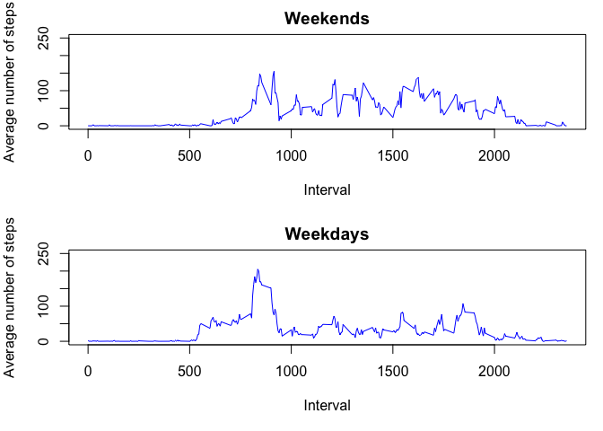

## Loading the data


```r
data <- read.csv("activity.csv")
summary(data)
```

```
##      steps                date          interval     
##  Min.   :  0.00   2012-10-01:  288   Min.   :   0.0  
##  1st Qu.:  0.00   2012-10-02:  288   1st Qu.: 588.8  
##  Median :  0.00   2012-10-03:  288   Median :1177.5  
##  Mean   : 37.38   2012-10-04:  288   Mean   :1177.5  
##  3rd Qu.: 12.00   2012-10-05:  288   3rd Qu.:1766.2  
##  Max.   :806.00   2012-10-06:  288   Max.   :2355.0  
##  NA's   :2304     (Other)   :15840
```

## What is the total number of steps taken per day

In this, missing steps will be ignored.
1. Calculte the total number of steps taken per day

```r
library(dplyr)
```

```
## 
## Attaching package: 'dplyr'
```

```
## The following objects are masked from 'package:stats':
## 
##     filter, lag
```

```
## The following objects are masked from 'package:base':
## 
##     intersect, setdiff, setequal, union
```

```r
data_with_valid_steps_only <- data[!is.na(data$steps),]
data_with_valid_steps_only <- group_by(data_with_valid_steps_only, date)
daily_step_count <-  summarize(data_with_valid_steps_only, steps_count=sum(steps))
head(daily_step_count)
```

```
## # A tibble: 6 x 2
##   date       steps_count
##   <fct>            <int>
## 1 2012-10-02         126
## 2 2012-10-03       11352
## 3 2012-10-04       12116
## 4 2012-10-05       13294
## 5 2012-10-06       15420
## 6 2012-10-07       11015
```

2. Histogram of Daily Step Count


```r
hist(daily_step_count$steps_count, ylab = "Days", xlab = "Steps Count", main = "Distribution of Steps Count")
```

<!-- -->

3. Calculate and report the mean and median of the total number of steps taken per day

```r
mean_steps_per_day <- mean(daily_step_count$steps_count)
median_steps_per_day <- median(daily_step_count$steps_count)
```

*Average number of steps taken per day is 1.0766189\times 10^{4}.
*Median number of steps taken per day is 10765


## What is the average daily activity pattern?

1. Make a time series plot (i.e. (type="l") of the 5-minute interval (x-axis) and the average number of steps taken, averaged across all days (y-axis)


```r
data_grouped_by_interval <- tapply(data_with_valid_steps_only$steps, data_with_valid_steps_only$interval, mean)
data_grouped_by_interval_df <- cbind(as.numeric(names(data_grouped_by_interval)), as.numeric(as.vector(data_grouped_by_interval)))
names(data_grouped_by_interval_df) <- c("Interval", "Avg.Steps")
plot(data_grouped_by_interval_df[,1], data_grouped_by_interval_df[,2], type = 'l', xlab="Time Interval", ylab="Average Number of Steps Taken", main="Average number of steps taken in every 5 minute interval of the day")
```

<!-- -->

2. Which 5-minute interval, on average across all the days in the dataset, contains the maximum number of steps?


```r
max_steps <- data_grouped_by_interval_df[which.max(data_grouped_by_interval_df[,2]),1]
```

Max number of steps occur in 835 interval

## Imputing missing values

1. Calculate and report the total number of missing values in the dataset (i.e. the total number of rows with NAs)


```r
rows_with_na <- sum(is.na(data))
```

There are 2304 rows with NAs

2. Devise a strategy for filling in all of the missing values in the dataset. The strategy does not need to be sophisticated. For example, you could use the mean/median for that day, or the mean for that 5-minute interval, etc.

We are imputing by setting values with  median number in that interval to steps that had N/A earlier

```r
data_new = data.frame(steps=numeric(), date=factor(), interval=integer() )
for (row in 1:nrow(data)) {
  if(is.na(data[row,1])) {
    med <- median(as.numeric(subset(data, interval == data[row,3])$steps), na.rm = TRUE)
    data_new <- rbind(data_new, c(steps=med,data[row,c(2,3)]))
  }
  else {
    data_new <- rbind(data_new, data[row,])
  }
  
}
```

3. Create a new dataset that is equal to the original dataset but with the missing data filled in.

A new dataset data_new has been  reated to include missing values

4. Make a histogram of the total number of steps taken each day and Calculate and report the mean and median total number of steps taken per day. Do these values differ from the estimates from the first part of the assignment? What is the impact of imputing missing data on the estimates of the total daily number of steps?


```r
data_new <- group_by(data_new, date)
daily_step_count <-  summarize(data_new, steps_count=sum(steps))
hist(daily_step_count$steps_count, ylab = "Days", xlab = "Steps Count", main = "Distribution of Steps Count")
```

<!-- -->


```r
mean_steps_per_day <- mean(daily_step_count$steps_count)
median_steps_per_day <- median(daily_step_count$steps_count)
```

*Average number of steps taken per day after imputing is 9503.8688525.
*Median number of steps taken per day after imputing is 1.0395\times 10^{4}

## Are there differences in activity patterns between weekdays and weekends?
For this part the weekdays() function may be of some help here. Use the dataset with the filled-in missing values for this part.

1. Create a new factor variable in the dataset with two levels – “weekday” and “weekend” indicating whether a given date is a weekday or weekend day.
2. Make a panel plot containing a time series plot (i.e. type="l") of the 5-minute interval (x-axis) and the average number of steps taken, averaged across all weekday days or weekend days (y-axis). See the README file in the GitHub repository to see an example of what this plot should look like using simulated data.


```r
weekends <- c("Saturday", "Sunday")
data_new$day_type <- lapply(data_new$date, function(X) ( if( weekdays(as.POSIXct(X)) %in% weekends ) {"weekend"} else {"weekday"}))

par(mfrow=c(2,1), mar = c(5, 4, 2, 1))

weekend_dataset <- subset(data_new, day_type == "weekend")
weekend_measurements <- as.data.frame(tapply(weekend_dataset$steps, weekend_dataset$interval, mean))
weekend_measurements <- cbind(weekend_measurements, unique(weekend_dataset$interval))
names(weekend_measurements) <- c("avg_no_of_steps", "interval")
with(weekend_measurements, plot(interval, avg_no_of_steps, type="l", col="blue", main="Weekends", xlab ="Interval", ylab="Average number of steps", ylim=c(0,250)))

weekday_dataset <- subset(data_new, day_type == "weekday")
weekday_measurements <- as.data.frame(tapply(weekday_dataset$steps, weekday_dataset$interval, mean))
weekday_measurements <- cbind(weekday_measurements, unique(weekday_dataset$interval))
names(weekday_measurements) <- c("avg_no_of_steps", "interval")
with(weekday_measurements, plot(interval, avg_no_of_steps, type="l", col="blue", main="Weekdays", xlab ="Interval", ylab="Average number of steps", ylim=c(0,250)))
```

<!-- -->
*On weekdays, we can see that average number of steps taken is around 200 between intervals 700 and 900. At other times, average steps taken is less than 100 typically.
*On weekends, we can see people tend to walk a lot throughout the day
